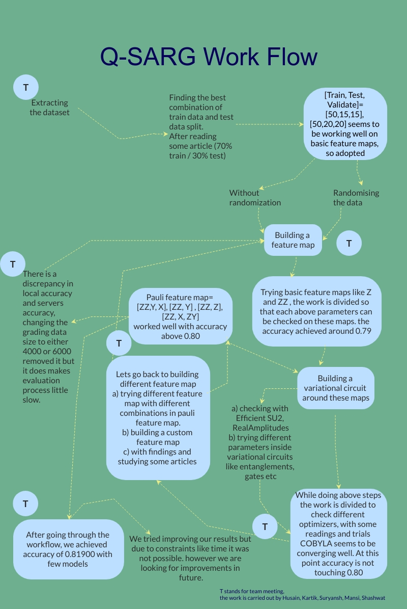

# Q-SARG
Qiskit Challenge India 2020 Final Challenge solution by team Q-SARG

We followed the idea of **"Changing a single function while keeping others factors constant and when found with the best one among them, proceed towards the next function or feature map."**

we have presented the flow of our work in brief with the following flow chart 

Here the [**Best_file.py**](Best_file.py) is the highest accuracy submission made by our team.  
